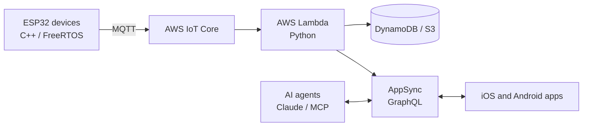

<h1 align="center">Manuel Núñez</h1>

  <b>Backend and AI Systems Engineer</b> 
  Device to cloud to agent, end to end.

  
  
  

---

I build complete systems: firmware on the device, serverless backends on AWS, real-time APIs for mobile apps, and AI agents that operate those APIs. Remote since 2017, working with US and international teams.

## What I build

## Highlights

- **Leadership:** lead an engineering team of about 20 across firmware, cloud, and web, and took a connected device from early prototypes to its first production batch.
- **Integration:** real-time bridge between AWS IoT Core and AppSync GraphQL subscriptions, so mobile apps monitor and control devices live.
- **Performance:** full-duplex binary UART protocol that cut a 2 MB firmware transfer between microcontrollers from 9 minutes to 45 seconds (12x).
- **AI agents:** an autonomous agent that operates a production GraphQL API as an ordinary Cognito user, with authorization kept in one place.

## Stack

  
  
  
  
  
  
  
  

  
  
  
  
  
  
  

---

Most of my work lives in private repositories; the contribution graph below counts it.
