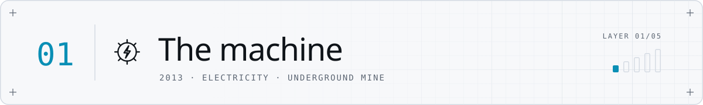
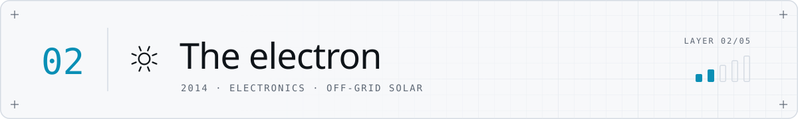
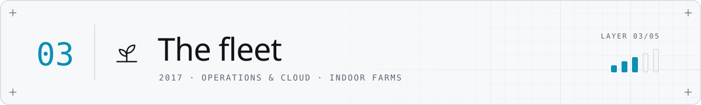
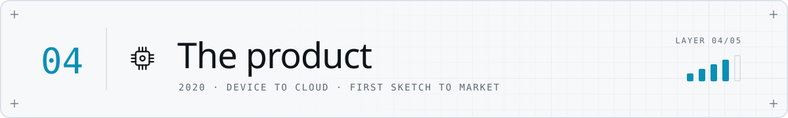
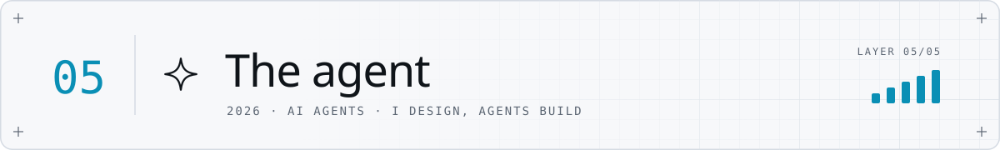

<picture>
  <source media="(prefers-color-scheme: dark)" srcset="assets/hero-dark.svg">
  
</picture>

I have worked on every layer between a power cable and an AI agent: electrical systems, circuit boards, firmware, cloud backends, real-time apps, and now agents. Each job added a layer. Together, they let me design systems end to end.

### The story

<picture>
  <source media="(prefers-color-scheme: dark)" srcset="assets/chapter-1-dark.svg">
  
</picture>

It started underground. My first job kept the electrical systems of a mine's heavy equipment running. Lesson one: real systems fail, and someone has to understand why.

<picture>
  <source media="(prefers-color-scheme: dark)" srcset="assets/chapter-2-dark.svg">
  
</picture>

I designed off-grid solar systems for rural communities in Honduras: the circuit boards, the embedded C firmware, the whole system. Engineering for places where nobody can call support.

<picture>
  <source media="(prefers-color-scheme: dark)" srcset="assets/chapter-3-dark.svg">
  
</picture>

Remote from Honduras, I kept a fleet of about 150 connected indoor-farming machines running for a US company, with Python health checks and event-driven automation. It was my first cloud work. I also designed the control system for its vertical farms.

<picture>
  <source media="(prefers-color-scheme: dark)" srcset="assets/chapter-4-dark.svg">
  
</picture>

A US hardware startup, from its first sketch: Arduino code in a shared Dropbox. Six years later: a connected device with about 500 units in the market, a serverless AWS backend, real-time mobile apps, and an engineering team of about 20 that I lead.

<picture>
  <source media="(prefers-color-scheme: dark)" srcset="assets/chapter-5-dark.svg">
  
</picture>

Today agents write the code, so my job moved up a layer: I design the system, then direct and review the agents that build it. One of them operates our team planner through the same API as the web app, signed in like any teammate.

### Blueprints

<picture>
  <source media="(prefers-color-scheme: dark)" srcset="assets/blueprints-dark.svg">
  
</picture>

Not a portfolio: these are systems I can design with what I know today. Any client can sit on either side, devices, phones, people, or other agents, and the stack in the middle is infrastructure as code. The first one is the one I run in production.

### Proof

- **~20 engineers** led across firmware, backend, and web.
- **~500 devices** in the market, from the first prototype to the first production batch.
- **12x faster** firmware transfer between microcontrollers: 2 MB in 45 seconds instead of 9 minutes.
- **0 resolvers changed** when an AI agent started operating a production GraphQL API: it signs in as an ordinary user, so authorization stays in one place.
- **2,000+ commits** since 2020, most of them in private repositories.

### Toolbox

<picture>
  <source media="(prefers-color-scheme: dark)" srcset="assets/toolbox-dark.svg">
  
</picture>

<picture>
  <source media="(prefers-color-scheme: dark)" srcset="assets/footer-dark.svg">
  
</picture>

<a href="https://www.linkedin.com/in/manuel-agentic-ai">LinkedIn</a>

Most of my work lives in private repositories; the contribution graph below counts it.

